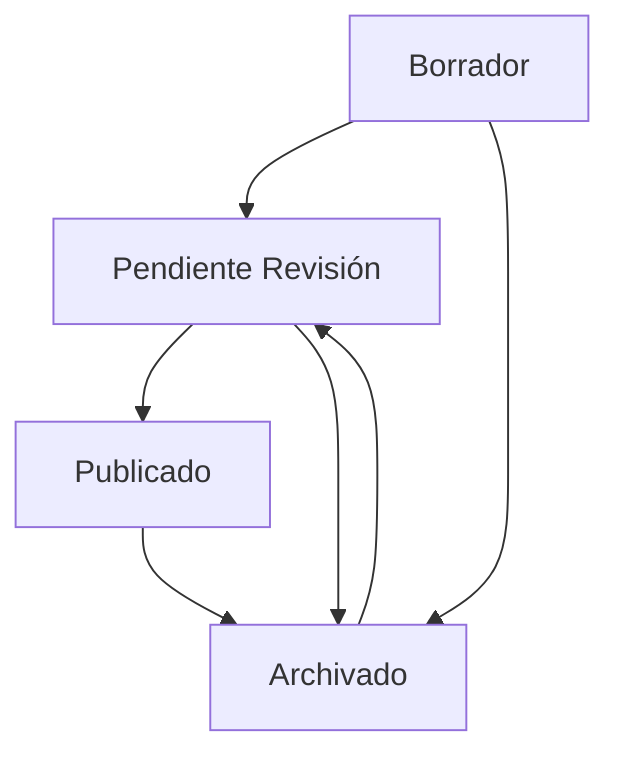

# Flujo de Aprobación de Publicaciones

## 📋 Descripción General

El sistema de publicaciones incluye un flujo completo de aprobación donde:
- **Usuarios** pueden crear y editar publicaciones
- **Usuarios** solicitan aprobación para publicar
- **Administradores** revisan y aprueban/rechazan publicaciones
- **Administradores** tienen permisos completos sobre todas las publicaciones

---

## 🔄 Flujo de Trabajo

### Para Usuarios Regulares:

```
1. Crear Publicación (estado: borrador)
   ↓
2. Editar/Completar Contenido
   ↓
3. Solicitar Aprobación (estado: pendiente_revision)
   ↓
4. Esperar Revisión del Administrador
   ↓
5a. ✅ Aprobada (estado: publicado) → Visible públicamente
   O
5b. ❌ Rechazada (estado: archivado) → No visible
```

### Para Administradores:

```
- Ver Publicaciones Pendientes
- Revisar Contenido
- Aprobar → Cambiar a "publicado"
  O
- Rechazar → Cambiar a "archivado"
- Además: Crear, Editar, Eliminar CUALQUIER publicación
```

---

## 🎯 Estados de Publicación

| Estado | Valor | Descripción | Quién Puede Ver |
|--------|-------|-------------|-----------------|
| **Borrador** | `borrador` | Publicación en creación | Solo el autor |
| **Pendiente Revisión** | `pendiente_revision` | Esperando aprobación del admin | Autor y admin |
| **Publicado** | `publicado` | Aprobado y visible | Todos |
| **Archivado** | `archivado` | Rechazado o archivado | Solo el autor y admin |

---

## 🔑 Roles y Permisos

### Usuario Regular (USER)
- ✅ Crear publicaciones (estado inicial: borrador)
- ✅ Editar sus propias publicaciones
- ✅ Solicitar aprobación de sus publicaciones
- ✅ Eliminar sus propias publicaciones
- ✅ Ver todas las publicaciones públicas
- ❌ Aprobar/rechazar publicaciones
- ❌ Editar publicaciones de otros usuarios

### Administrador (ADMIN)
- ✅ **TODO lo que puede hacer un usuario regular**
- ✅ **Aprobar publicaciones** pendientes
- ✅ **Rechazar publicaciones** pendientes
- ✅ **Ver todas las publicaciones** pendientes
- ✅ **Editar CUALQUIER publicación** (incluso de otros usuarios)
- ✅ **Eliminar CUALQUIER publicación**
- ✅ **Crear publicaciones** (pueden publicar directamente sin aprobación)

---

## 📡 Endpoints del Flujo de Aprobación

### 1. Solicitar Aprobación (Usuario)

**Endpoint:** `POST /publications/:id/request-approval`

**Permisos:** Usuario autenticado (autor de la publicación)

**Headers:**
```
Authorization: Bearer {token}
```

**Descripción:** Cambia el estado de la publicación de "borrador" a "pendiente_revision"

**Response (200 OK):**
```json
{
  "success": true,
  "message": "Solicitud de aprobación enviada exitosamente",
  "data": {
    "id": "uuid",
    "title": "Mi Publicación",
    "status": "pendiente_revision",
    ...
  }
}
```

**Errores:**
- `403 Forbidden`: No eres el autor de la publicación
- `400 Bad Request`: La publicación ya está en revisión o ya está publicada

---

### 2. Ver Publicaciones Pendientes (Admin)

**Endpoint:** `GET /publications/admin/pending`

**Permisos:** Solo administradores

**Headers:**
```
Authorization: Bearer {token_admin}
```

**Query Parameters:**
- `page`: Número de página (default: 1)
- `limit`: Elementos por página (default: 10)
- `sortBy`: Campo de ordenamiento
- `order`: Orden (ASC, DESC)
- `search`: Búsqueda en título y contenido

**Response (200 OK):**
```json
{
  "success": true,
  "data": [
    {
      "id": "uuid",
      "title": "Publicación Pendiente 1",
      "content": "Contenido...",
      "category": "danza",
      "status": "pendiente_revision",
      "author": {
        "id": "uuid",
        "firstName": "Juan",
        "lastName": "Pérez"
      },
      "createdAt": "2025-10-02T10:30:00Z"
    }
  ],
  "meta": {
    "total": 5,
    "page": 1,
    "limit": 10,
    "totalPages": 1
  }
}
```

---

### 3. Aprobar o Rechazar Publicación (Admin)

**Endpoint:** `POST /publications/:id/approve`

**Permisos:** Solo administradores

**Headers:**
```
Authorization: Bearer {token_admin}
Content-Type: application/json
```

**Request Body:**
```json
{
  "status": "publicado",
  "message": "Aprobado: Excelente contenido cultural"
}
```

**Opciones de Status:**
- `"publicado"`: Aprobar la publicación
- `"archivado"`: Rechazar la publicación

**Response (200 OK) - Aprobada:**
```json
{
  "success": true,
  "message": "Publicación aprobada exitosamente",
  "data": {
    "id": "uuid",
    "title": "Mi Publicación",
    "status": "publicado",
    ...
  }
}
```

**Response (200 OK) - Rechazada:**
```json
{
  "success": true,
  "message": "Publicación rechazada",
  "data": {
    "id": "uuid",
    "title": "Mi Publicación",
    "status": "archivado",
    ...
  }
}
```

---

## 💡 Ejemplos de Uso Completo

### Ejemplo 1: Flujo Completo de Usuario

```bash
# 1. Usuario crea publicación (borrador)
curl -X POST http://localhost:3000/publications \
  -H "Authorization: Bearer USER_TOKEN" \
  -H "Content-Type: application/json" \
  -d '{
    "title": "Festival de Danza Folklórica 2025",
    "content": "Invitamos a todos al festival...",
    "category": "danza",
    "imageUrl": "https://example.com/image.jpg"
  }'

# 2. Usuario edita publicación
curl -X PATCH http://localhost:3000/publications/{id} \
  -H "Authorization: Bearer USER_TOKEN" \
  -H "Content-Type: application/json" \
  -d '{
    "content": "Contenido actualizado con más información..."
  }'

# 3. Usuario solicita aprobación
curl -X POST http://localhost:3000/publications/{id}/request-approval \
  -H "Authorization: Bearer USER_TOKEN"
```

### Ejemplo 2: Flujo de Administrador

```bash
# 1. Admin ve publicaciones pendientes
curl http://localhost:3000/publications/admin/pending \
  -H "Authorization: Bearer ADMIN_TOKEN"

# 2a. Admin aprueba publicación
curl -X POST http://localhost:3000/publications/{id}/approve \
  -H "Authorization: Bearer ADMIN_TOKEN" \
  -H "Content-Type: application/json" \
  -d '{
    "status": "publicado",
    "message": "Contenido aprobado"
  }'

# O 2b. Admin rechaza publicación
curl -X POST http://localhost:3000/publications/{id}/approve \
  -H "Authorization: Bearer ADMIN_TOKEN" \
  -H "Content-Type: application/json" \
  -d '{
    "status": "archivado",
    "message": "Contenido no cumple con las normas"
  }'
```

### Ejemplo 3: Admin con Permisos Especiales

```bash
# Admin puede editar cualquier publicación
curl -X PATCH http://localhost:3000/publications/{id} \
  -H "Authorization: Bearer ADMIN_TOKEN" \
  -H "Content-Type: application/json" \
  -d '{
    "title": "Título corregido por admin",
    "content": "Contenido mejorado"
  }'

# Admin puede eliminar cualquier publicación
curl -X DELETE http://localhost:3000/publications/{id} \
  -H "Authorization: Bearer ADMIN_TOKEN"

# Admin puede crear publicaciones ya publicadas (sin aprobación)
curl -X POST http://localhost:3000/publications \
  -H "Authorization: Bearer ADMIN_TOKEN" \
  -H "Content-Type: application/json" \
  -d '{
    "title": "Anuncio Oficial",
    "content": "Contenido...",
    "category": "artista_local",
    "status": "publicado"
  }'
```

---

## 🔒 Seguridad y Validaciones

### Validaciones Implementadas:

1. **Solicitud de Aprobación:**
   - ✅ Solo el autor puede solicitar aprobación
   - ✅ No se puede solicitar si ya está en revisión
   - ✅ No se puede solicitar si ya está publicada

2. **Aprobación/Rechazo:**
   - ✅ Solo administradores pueden aprobar/rechazar
   - ✅ El estado debe ser "publicado" o "archivado"

3. **Edición:**
   - ✅ El autor puede editar sus propias publicaciones
   - ✅ Los administradores pueden editar cualquier publicación

4. **Eliminación:**
   - ✅ El autor puede eliminar sus propias publicaciones
   - ✅ Los administradores pueden eliminar cualquier publicación

---

## 📊 Estados y Transiciones Permitidas



### Transiciones:
- `borrador` → `pendiente_revision`: Usuario solicita aprobación
- `pendiente_revision` → `publicado`: Admin aprueba
- `pendiente_revision` → `archivado`: Admin rechaza
- `publicado` → `archivado`: Admin archiva
- `archivado` → `pendiente_revision`: Reenviar a revisión (editar y solicitar de nuevo)

---

## ⚠️ Notas Importantes

1. **Usuarios regulares NO pueden:**
   - Publicar directamente sin aprobación
   - Ver publicaciones de otros usuarios en estado borrador
   - Aprobar sus propias publicaciones

2. **Administradores tienen acceso completo:**
   - Pueden crear publicaciones ya en estado "publicado"
   - Pueden editar y eliminar cualquier publicación
   - Pueden cambiar el estado de cualquier publicación

3. **Publicaciones visibles públicamente:**
   - Solo las publicaciones con estado "publicado" son visibles en el endpoint público `GET /publications`

4. **Notificaciones (para implementación futura):**
   - Usuario recibe notificación cuando su publicación es aprobada/rechazada
   - Admin recibe notificación cuando hay nuevas publicaciones pendientes

---

## 🎓 Casos de Uso

### Caso 1: Usuario Nuevo
1. Usuario se registra
2. Crea su primera publicación (estado: borrador)
3. Agrega contenido e imagen
4. Solicita aprobación
5. Admin revisa y aprueba
6. Publicación visible para todos

### Caso 2: Usuario Experimentado
1. Usuario crea publicación
2. Solicita aprobación inmediatamente
3. Admin rechaza (contenido incompleto)
4. Usuario edita y mejora contenido
5. Solicita aprobación nuevamente
6. Admin aprueba
7. Publicación visible

### Caso 3: Admin Moderador
1. Admin ve lista de publicaciones pendientes
2. Revisa cada una
3. Aprueba las que cumplen normas
4. Rechaza las que no cumplen
5. Puede editar directamente publicaciones con errores menores
6. Mantiene la calidad del contenido público

---

## 🚀 Siguientes Pasos Recomendados

1. **Sistema de Notificaciones:**
   - Enviar email cuando se aprueba/rechaza
   - Notificaciones en tiempo real

2. **Comentarios del Admin:**
   - Permitir que el admin deje comentarios al rechazar
   - Historial de revisiones

3. **Dashboard Admin:**
   - Estadísticas de publicaciones pendientes
   - Métricas de aprobación/rechazo

4. **Workflow Avanzado:**
   - Múltiples niveles de aprobación
   - Revisores especializados por categoría

---

¡El sistema de aprobación está completamente funcional y listo para usar! 🎉

