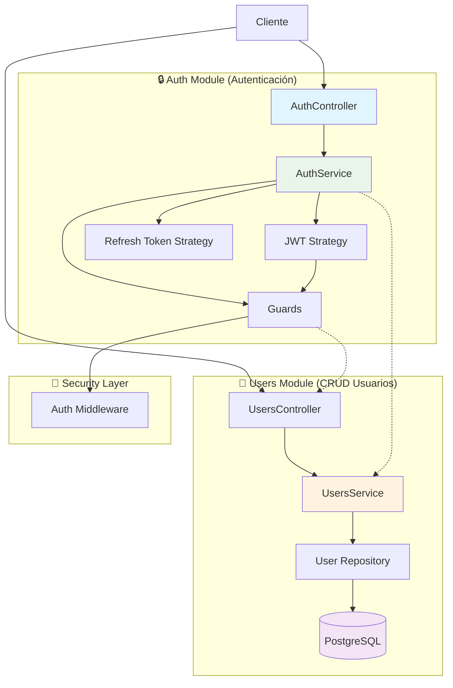

# 🦎 Guana Vive Backend

<p align="center">
  
  
  
  
  
</p>

<p align="center">
  Backend API construido con <strong>NestJS</strong>, <strong>TypeScript</strong> y <strong>PostgreSQL</strong> que implementa un sistema completo de autenticación JWT y gestión de usuarios para la plataforma cultural guanacasteca.
</p>

## � Estado Actual del Proyecto - ✅ **MVP COMPLETO**

```mermaid
graph TB
    A[🔐 Sistema de Autenticación] --> B[✅ Registro de Usuarios]
    A --> C[✅ Login con JWT]
    A --> D[✅ Refresh Tokens]
    A --> E[✅ Validación de Tokens]
    A --> F[✅ Endpoints Protegidos]
    
    G[👥 Gestión de Usuarios] --> H[✅ CRUD Usuarios]
    G --> I[✅ Listado Paginado]
    G --> J[✅ Validación de Datos]
    G --> K[✅ Encriptación BCrypt]
    
    L[�️ Arquitectura] --> M[✅ Módulos Separados]
    L --> N[✅ TypeScript Tipado]
    L --> O[✅ Docker Ready]
    L --> P[✅ Probado y Funcional]
```



## 🎯 Características Implementadas y Probadas

### 🤖 **Claude Code Agent** 
- ✅ Backend Architect especializado en monolitos
- 📁 Config: `.claude/` (agent + context + commands)

### 🔒 **Sistema de Autenticación JWT - FUNCIONAL**
- ✅ **Registro de usuarios** con validación de email único
- ✅ **Login seguro** con contraseñas encriptadas (bcrypt)
- ✅ **JWT Access Tokens** (15m de duración) 
- ✅ **Refresh Tokens** (7d de duración)
- ✅ **Validación de tokens** con guards automáticos
- ✅ **Endpoint `/auth/me`** para perfil del usuario
- ✅ **Arquitectura separada** Auth ↔ Users

### 👥 **Gestión de Usuarios - PROBADO**
- ✅ **CRUD completo** de usuarios
- ✅ **Listado paginado** con filtros avanzados
- ✅ **Protección JWT** en endpoints sensibles
- ✅ **Roles de usuario** (USER, ADMIN)
- ✅ **Validación automática** de datos de entrada
- ✅ **Respuestas tipadas** sin información sensible

### 🏛️ **Arquitectura Clean & Escalable**
- ✅ **Separación total** de responsabilidades 
- ✅ **TypeScript 100%** sin uso de `any`
- ✅ **Interfaces consistentes** para todas las respuestas
- ✅ **Logging detallado** para debugging
- ✅ **Manejo de errores** robusto con códigos HTTP apropiados

## 🛠️ Tecnologías Utilizadas

- **Framework**: NestJS con TypeScript
- **Base de Datos**: PostgreSQL
- **ORM**: TypeORM
- **Autenticación**: JWT + bcrypt
- **Validación**: class-validator
- **Contenización**: Docker & Docker Compose
- **Gestión de Paquetes**: pnpm

## 🏗️ Arquitectura - Sistema Refactorizado ✅

El proyecto sigue una **arquitectura modular limpia** con **separación clara de responsabilidades**:



### **📂 Separación de Responsabilidades**
- **🔒 Auth Module**: Solo autenticación (register, login, JWT)
- **👥 Users Module**: Solo operaciones CRUD de usuarios
- **🛡️ Guards**: Protección centralizada de rutas
- **📊 DTOs**: Validación y tipado de datos de entrada/salida

## 📁 Estructura del Proyecto

```
src/
├── config/           # Configuraciones (DB, JWT, etc.)
├── users/            # Módulo de usuarios
│   ├── dto/          # Data Transfer Objects
│   ├── entities/     # Entidades de base de datos
│   ├── types/        # Tipos, interfaces y enums
│   └── ...
├── app.module.ts     # Módulo principal
└── main.ts          # Punto de entrada
```

## ⚙️ Configuración del Proyecto

## ⚙️ Configuración del Proyecto

### 📋 Prerrequisitos

- Node.js (v18 o superior)
- pnpm
- Docker y Docker Compose
- PostgreSQL (opcional si usas Docker)

### 🔧 Instalación

1. **Clonar el repositorio**
```bash
git clone https://github.com/VictorJB16/guana-vive-backend.git
cd guana-vive-backend
```

2. **Instalar dependencias**
```bash
pnpm install
```

3. **Configurar variables de entorno**
```bash
cp .env.example .env
# Editar .env con tus configuraciones
```

4. **Levantar la base de datos con Docker**
```bash
docker-compose up -d
```

5. **Ejecutar migraciones** (próximamente)
```bash
pnpm run migration:run
```

### 🚀 Ejecución

```bash
# Desarrollo
pnpm run start:dev

# Producción
pnpm run start:prod
```

### 🌱 Seed de Datos (Desarrollo)

Para poblar la base de datos con datos de prueba:

```bash
pnpm run seed
```

> **⚠️ IMPORTANTE - SEGURIDAD:**
> - Las contraseñas del seed son **SOLO para desarrollo local**
> - **NUNCA** usar estas contraseñas en producción
> - Configurar `SEED_ADMIN_PASSWORD` y `SEED_USER_PASSWORD` en `.env` para personalizar
> - Por defecto: `Admin123!` (admin) y `Usuario123!` (usuarios regulares)

**Usuarios creados por el seed:**
- 👑 Admin: `admin@guanavive.com`
- 👤 Usuario 1: `usuario@guanavive.com` (Plan Premium)
- 👤 Usuario 2: `maria@guanavive.com` (Plan Básico)

**Datos incluidos:**
- 3 usuarios con diferentes roles
- 6 categorías culturales
- 2 planes de suscripción
- 20 publicaciones culturales de Guanacaste

## 🔌 API Endpoints

### 👤 Usuarios (`/users`)

| Método | Endpoint | Descripción |
|--------|----------|-------------|
| POST | `/users` | Crear usuario |
| GET | `/users` | Listar usuarios con filtros |
| GET | `/users/:id` | Obtener usuario por ID |
| GET | `/users/email/:email` | Obtener usuario por email |
| PATCH | `/users/:id` | Actualizar usuario |
| PATCH | `/users/:id/change-password` | Cambiar contraseña |
| PATCH | `/users/:id/toggle-status` | Activar/desactivar usuario |
| DELETE | `/users/:id` | Eliminar usuario |
| POST | `/users/validate` | Validar credenciales |
| POST | `/users/login` | Iniciar sesión |

## 🧪 Testing Manual - ✅ Verificado

### **Endpoints de Autenticación Probados**

```bash
# 1. Registro de usuario (✅ FUNCIONA)
curl -X POST http://localhost:3000/auth/register \
  -H "Content-Type: application/json" \
  -d '{
    "email": "usuario@ejemplo.com",
    "password": "password123",
    "firstName": "Nombre",
    "lastName": "Apellido"
  }'

# Respuesta exitosa:
{
  "success": true,
  "message": "Usuario registrado exitosamente",
  "user": {
    "id": "9c7cb26a-d002-4352-8d92-35631c13932a",
    "email": "usuario@ejemplo.com",
    "firstName": "Nombre",
    "lastName": "Apellido", 
    "role": "user"
  }
}

# 2. Login de usuario (✅ FUNCIONA)
curl -X POST http://localhost:3000/auth/login \
  -H "Content-Type: application/json" \
  -d '{
    "email": "usuario@ejemplo.com",
    "password": "password123"
  }'

# Respuesta con tokens:
{
  "access_token": "eyJhbGciOiJIUzI1NiIsInR5cCI6IkpXVCJ9...",
  "refresh_token": "eyJhbGciOiJIUzI1NiIsInR5cCI6IkpXVCJ9...",
  "user": { /* datos del usuario */ }
}

# 3. Acceso a endpoints protegidos (✅ FUNCIONA)
# Sin token → 401 Unauthorized
curl -X GET http://localhost:3000/users
{"message":"Unauthorized","statusCode":401}

# Con token → 200 OK con datos
curl -X GET http://localhost:3000/users \
  -H "Authorization: Bearer YOUR_ACCESS_TOKEN"

# Respuesta exitosa con paginación:
{
  "success": true,
  "data": [
    {
      "id": "ce72f293-5003-413f-897a-9b1607532254",
      "email": "maria@example.com",
      "firstName": "Maria",
      "lastName": "Gomez",
      "isActive": true,
      "role": "user",
      "createdAt": "2025-09-25T11:46:31.032Z",
      "updatedAt": "2025-09-25T11:46:31.032Z"
    }
  ],
  "meta": {
    "total": 2,
    "page": 1,
    "limit": 10,
    "totalPages": 1
  }
}
```

### **🔍 Tests Automatizados (Próximamente)**
```bash
# Tests unitarios
pnpm run test

# Tests e2e  
pnpm run test:e2e

# Cobertura de tests
pnpm run test:cov
```

## 📊 Base de Datos

### 🏗️ Esquema Actual

#### Tabla `users`
- `id` (UUID, PK)
- `email` (VARCHAR, UNIQUE)
- `password` (VARCHAR, hasheada)
- `firstName` (VARCHAR)
- `lastName` (VARCHAR)
- `role` (ENUM: 'user', 'admin')
- `isActive` (BOOLEAN)
- `createdAt` (TIMESTAMP)
- `updatedAt` (TIMESTAMP)

### 🔄 Migraciones

```bash
# Generar migración
pnpm run migration:generate -- src/migrations/MigrationName

# Ejecutar migraciones
pnpm run migration:run

# Revertir migración
pnpm run migration:revert
```

## 🌍 Variables de Entorno

```env
# Base de datos
DATABASE_HOST=localhost
DATABASE_PORT=5432
DATABASE_USERNAME=postgres
DATABASE_PASSWORD=password
DATABASE_NAME=guana_vive_db

# Aplicación
PORT=3000
NODE_ENV=development

# JWT
JWT_SECRET=your-super-secret-jwt-key-here
JWT_EXPIRES_IN=1d

# CORS
CORS_ORIGIN=http://localhost:3000
```

## 🗺️ Roadmap

### ✅ Fase 1 - Fundación (Completada)
- [x] Configuración inicial del proyecto
- [x] Sistema de usuarios completo
- [x] Autenticación JWT
- [x] Base de datos PostgreSQL
- [x] Documentación base

### 🚧 Fase 2 - Sistema de Anuncios (En Desarrollo)
- [ ] Modelo de anuncios
- [ ] CRUD de anuncios
- [ ] Sistema de categorías
- [ ] Carga de imágenes
- [ ] Sistema de búsqueda

### 📅 Fase 3 - Funcionalidades Avanzadas
- [ ] Sistema de comentarios y valoraciones
- [ ] Notificaciones
- [ ] Sistema de mensajería
- [ ] Geolocalización
- [ ] Dashboard administrativo

### 🎨 Fase 4 - Mejoras UX/UI
- [ ] API de recomendaciones
- [ ] Estadísticas y analytics
- [ ] Integración con redes sociales
- [ ] Sistema de reportes

## 🤝 Contribución

1. Fork el proyecto
2. Crea una rama para tu feature (`git checkout -b feature/AmazingFeature`)
3. Commit tus cambios (`git commit -m 'Add some AmazingFeature'`)
4. Push a la rama (`git push origin feature/AmazingFeature`)
5. Abre un Pull Request

## 📄 Licencia

Este proyecto está bajo la Licencia MIT. Ver el archivo `LICENSE` para más detalles.

## 👨‍💻 Autor

**Victor Bustos** - [VictorJB16](https://github.com/VictorJB16)

## 🙏 Agradecimientos

- Inspirado en la rica cultura de Guanacaste, Costa Rica
- Construido con amor por la preservación cultural
- Dedicado a todos los guanacastecos que mantienen vivas sus tradiciones

---

<p align="center">
  <strong>¡Pura Vida! 🇨🇷</strong><br>
  Hecho con ❤️ para promover la cultura guanacasteca
</p>
```

## Deployment

When you're ready to deploy your NestJS application to production, there are some key steps you can take to ensure it runs as efficiently as possible. Check out the [deployment documentation](https://docs.nestjs.com/deployment) for more information.

If you are looking for a cloud-based platform to deploy your NestJS application, check out [Mau](https://mau.nestjs.com), our official platform for deploying NestJS applications on AWS. Mau makes deployment straightforward and fast, requiring just a few simple steps:

```bash
$ pnpm install -g @nestjs/mau
$ mau deploy
```

With Mau, you can deploy your application in just a few clicks, allowing you to focus on building features rather than managing infrastructure.

## 🤖 Claude Agent

```bash
@backend-architect [tu pregunta]
# Ejemplos: optimiza endpoint, diseña módulo, implementa caching
```

## Resources

Check out a few resources that may come in handy when working with NestJS:

- Visit the [NestJS Documentation](https://docs.nestjs.com) to learn more about the framework.
- For questions and support, please visit our [Discord channel](https://discord.gg/G7Qnnhy).
- To dive deeper and get more hands-on experience, check out our official video [courses](https://courses.nestjs.com/).
- Deploy your application to AWS with the help of [NestJS Mau](https://mau.nestjs.com) in just a few clicks.
- Visualize your application graph and interact with the NestJS application in real-time using [NestJS Devtools](https://devtools.nestjs.com).
- Need help with your project (part-time to full-time)? Check out our official [enterprise support](https://enterprise.nestjs.com).
- To stay in the loop and get updates, follow us on [X](https://x.com/nestframework) and [LinkedIn](https://linkedin.com/company/nestjs).
- Looking for a job, or have a job to offer? Check out our official [Jobs board](https://jobs.nestjs.com).

## Support

Nest is an MIT-licensed open source project. It can grow thanks to the sponsors and support by the amazing backers. If you'd like to join them, please [read more here](https://docs.nestjs.com/support).

## Stay in touch

- Author - [Kamil Myśliwiec](https://twitter.com/kammysliwiec)
- Website - [https://nestjs.com](https://nestjs.com/)
- Twitter - [@nestframework](https://twitter.com/nestframework)

## License

Nest is [MIT licensed](https://github.com/nestjs/nest/blob/master/LICENSE).
